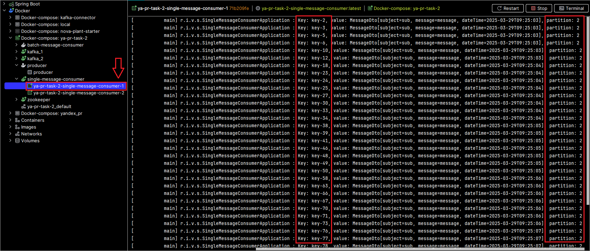
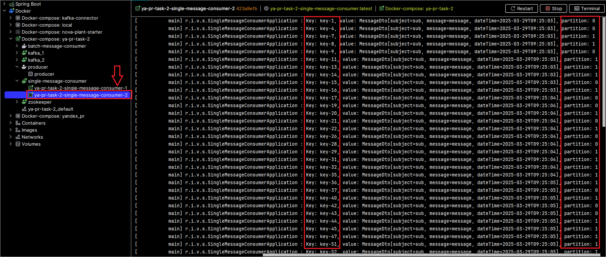
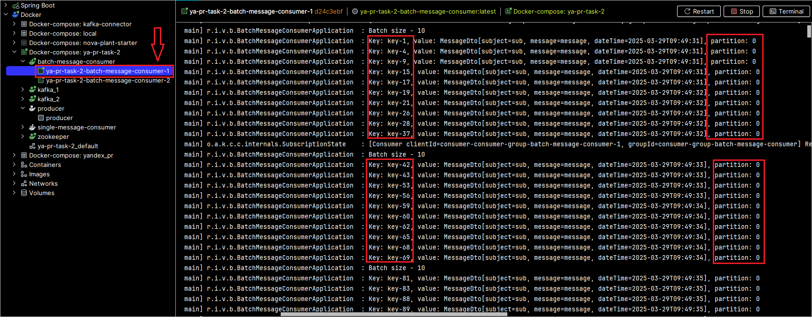
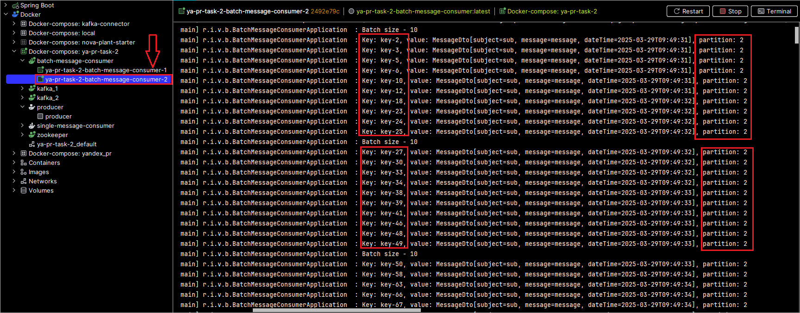

# ЯНДЕКС ПРАКТИКУМ ЗАДАНИЕ №2

## Структура проекта:

* **producer** - модуль предназначен для отправки сообщений. В бесконечном цикле производится публикация сообщений в топик kafka.
* **single-message-consumer** - подписан на топик kafka и предназначен для получения одиночных сообщений. После получения выводит в консоль.
* **batch-message-consumer** - подписан на топик kafka и предназначен для получения серии сообщений. После получения выводит в консоль размер пакета и, в цикле, каждое сообщение в отдельности.
* **common** - модуль-библиотека, содержащий общие для всех классы: DTO и список топиков.

## Сторонние сервисы
* zookeeper
* kafka

## Описание работы приложения

Метод `run` класса `ru.ivan.ver.producer.ProducerApplication`, модуля `producer` отвечает за отправку сообщений в Kafka 
в бесконечном цикле. Каждое сообщение (объект `MessageDto`) содержит:
* subject (тема): sub - статичная строка;
* message (текст сообщения): message - статичная строка;
* dateTime (временная метка): текущее время;

Ключ сообщения снабжается меткой `num`, значение которой инкрементируется с каждой итерацией. Это сделано для того, чтобы 
можно было легко найти сообщения в соответсвующих консюмерах. После каждой отправки выполняется задержка 50 мс. При 
завершении работы продюсер корректно закрывается.

Косьюмеры (модули `single-message-consumer` и `batch-message-consumer`) получают сообщения: первый по-одному, 
второй - пакетом. 

В методе `run` класса `ru.ivan.ver.singlemessageconsumer.SingleMessageConsumerApplication`, модуля `single-message-consumer`
в бесконечном цикле производится вычитывание сообщения и вывод содержимого в консоль в формате
`Key: key-<номер>, value: MessageDto[subject=sub, message=message, dateTime=<текущие дата/время>], partition: <номер партиции>`

Методе `run` класса `ru.ivan.ver.batchmessageconsumer.BatchMessageConsumerApplication`, модуля `batch-message-consumer`
работает похожим образом, за исключением того, что за раз вычитывется 10 сообщений и в цикле выводится содержимое каждого сообщения.
Коммит производится только если размер пакета - 10 сообщений. Вычитывание пакета производится с задержкой в 1 сек., чтобы 
успели накопиться сообщения в пакете.

## Требования для успешного запуска
* Java 21
* Apache Maven 3.9.9
* Docker 24.0.6

## Запуск
1) зайти в папку проекта *ya-pr-task-2*
2) выполнить команду `mvn clean install -DskipTests`
3) запустить Docker-контейнеры командой `docker compose up -d`

## Результат корректной работы приложения
Согласно условию задания должно быть запущено по 2 инстанса каждого косьюмера (`single-message-consumer` и 
`batch-message-consumer`). 

Т.к. `group-id` одинаковый для инстансов `single-message-consumer`, а партиций 3, должна производится балансировка.

фиг.1 - Лог инстанса 1 single-message-consumer

фиг.2 - Лог инстанса 2 single-message-consumer

На изображениях выше показаны логи выполнения приложения в двух инстансах. Если их систематизировать в виде таблицы 
(для простоты возьмем первые 7 сообщений):

| Ключ  | Инстанс | Партиция |
|-------|---------|----------|
| key-1 | 2       | 0        |
| key-2 | 1       | 2        |
| key-3 | 1       | 2        |
| key-4 | 2       | 0        |
| key-5 | 1       | 2        |
| key-6 | 1       | 2        |
| key-7 | 2       | 1        |
| ...   | ...     | ...      |

Проанализировав первые 7 сообщений, видно, что для двух инстансов (как и для трех партиций) нет одинаковых сообщений.
Сочетание Ключ + Инстанс + Партиция - уникальное значение, следовательно балансировка между партициями работает штатно.

Аналогично для инстансов `batch-message-consumer`

фиг.3 - Лог инстанса 1 batch-message-consumer

фиг.4 - Лог инстанса 2 batch-message-consumer

Партиция 1 встречается позднее:

фиг.5 - Лог инстанса 1 batch-message-consumer

## Примечание
Для создания топика нет необходимости выполнять команду вручную. В конфигурации модуля **produser** топик с необходимым количеством партиций и реплик создается с помощью **AdminClient**. 

Подробное описание классов (полей и методов), как и параметров Kafka см. в файлах класса

Запуск приложения в соответсвии с инструкцией по запуску (см. выше) тестировался как на локальном компьютере, так и на 
удаленном сервере с установленными maven и docker. В обоих случаях приложение собралось, упаковалось в контейнер и запустилось без проблем.